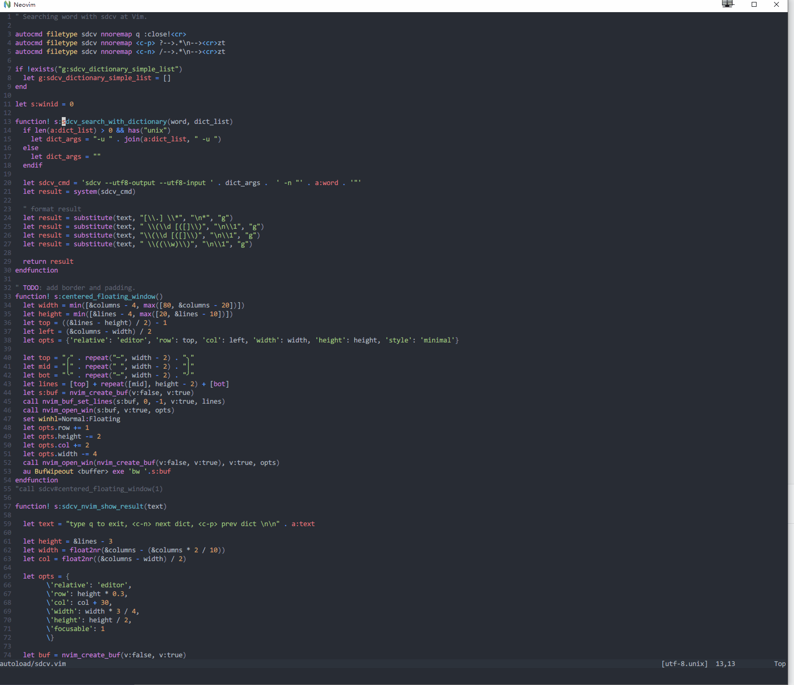

# vim-sdcv

在vim里面使用sdcv，支持vim和neovim。

配置:


绑定快捷键
```vimscript
nnoremap g. :<c-u>call sdcv#search_pointer()<cr>
vnoremap <silent> g. v:<c-u>call sdcv#search_selection()<cr>
```

字典设置
```
" 如果不配置，默认使用所有字典
" 注意:这个配置不会对windows生效, 因为 windows 里面 sdcv -u 参数不能是中文
let g:sdcv_dictionary_simple_list = [
			\"懒虫简明英汉词典",
			\"懒虫简明汉英词典",
			\"朗道英汉字典5.0",
			\"朗道汉英字典5.0",
			\"新华字典",
			\]
```

使用:
查询开始后光标会聚焦在 popup window 上，你可以用下面的快捷键操作
 q 退出
 <c-n> 跳到下一个字典
 <c-p> 跳到上一个字典


[windows 安装 sdcv 的方法](./compile-sdcv-in-msys2.md)
# TODO
[x] 能够查询短语
[x] 添加可控制的宽度
[x] 添加滚动支持


